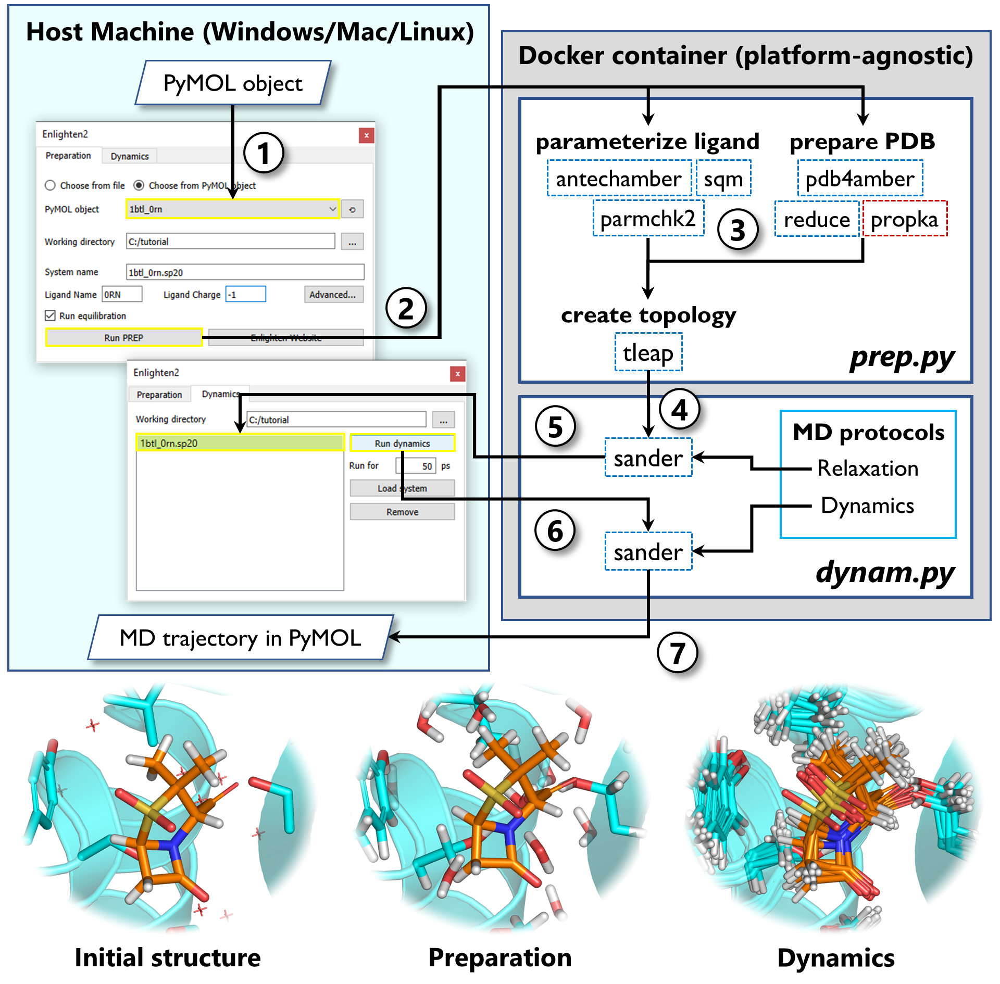

**24.06.2020**: Fixed bug in the Docker image. If you tried to run the PyMOL plugin before this date, please run

`docker image rm kzinovjev/enlighten2`

in the terminal.

-------

To acknowledge the use of the Enlighten2 plugin and/or protocols, please refer to this website.
(There is no publication to cite yet, please check back later.)

Aimed at:
 
- Experimental biochemists/enzymologists interested in gaining detailed insight into protein-ligand / enzyme-substrate complexes.
- Biomolecular researchers that would like to perform simulations in a high(er)-throughput fashion, e.g. for testing and hypothesis generation

**Minimal software requirements**

- [Docker](https://docs.docker.com/install/)
- [PyMOL](https://github.com/schrodinger/pymol-open-source) version 2.0 or higher.

**Package overview**

Enlighten2 allows to easily prepare and run molecular dynamics simulations of 
protein-ligand systems. It requires no installation or knowledge of computational
chemistry software and can be run on any machine (Windows, Mac or Linux) that has 
[PyMOL](https://github.com/schrodinger/pymol-open-source) and 
[Docker](https://docs.docker.com/install/) installed. It consists of three main parts:
1. *The Python package* containing a set of wrappers for 
[AmberTools19](https://ambermd.org/AmberTools.php) and 
[Propka3.1](https://github.com/jensengroup/propka-3.1). 
2. *Docker image* containing preinstalled Enlighten2 Python package, 
AmberTools19 and Propka3.1.  
3. *The PyMOL plugin* that provides a user friendly graphical interface to 
the Enlighten tools.

**The Enlighten2 workflow**

1. Choose the PyMOL object in the Enlighten2 plugin and specify
the system parameters (ligand charge, solvent sphere size etc.)
2. Run preparation protocol. The plugin prepares all the input files and calls
Docker to create the container from Enlighten2 image. If needed, the image is 
fetched automatically from DockerHub.
3. Preparation protocol (prep.py) parameterizes the ligand, cleans up the protein 
structure and generated the simulation system. 
4. The prepared system is passed to molecular dynamics wrapper (dynam.py) to 
run the relaxation protocol.
5. The relaxed system is passed back to PyMOL.
6. Inspect the system and if there are no problems run the dynamics 
protocol for the desired simulation time.
7. When the simulation is finished, the molecular dynamics trajectory is passed
back to PyMOL.

-----------

Bugs in the Enlighten plugin or scripts can be reported as an "Issue" through 
the [github site](https://github.com/vanderkamp/enlighten2/issues).

If you have feature requests, in-depth feedback or other thoughts about Enlighten that you would like to share, please [get in touch](mailto:marc.vanderkamp@bristol.ac.uk).
