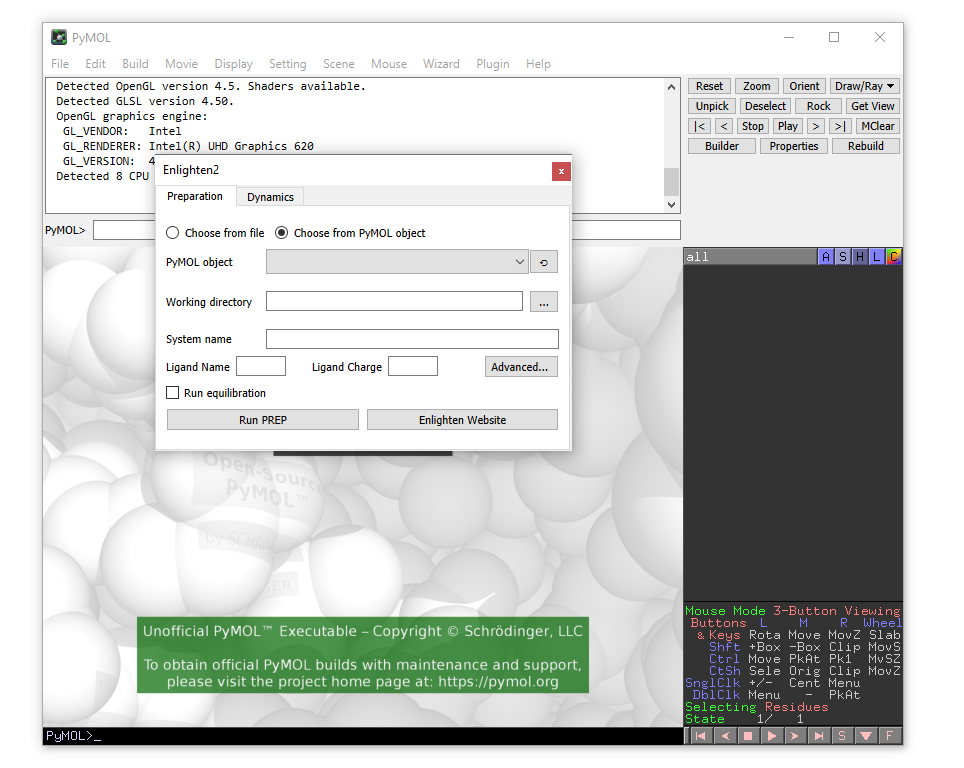

## Installation

1. This instruction assumes that Docker and PyMOL are already installed on your
system. We will first obtain the Enlighten plugin from the github repository. It 
can be done either by clicking on "Download PyMOL plugin" on top of this page or 
from the [github repository](https://github.com/vanderkamp/enlighten2-pymol).

2. Open PyMOL. The following window will appear, consisting of a viewing window 
and a control panel:

3. We now need to load the enlighten plugin into PyMOL. From the menu bar
choose Plugin and then Plugin Manager.

4. In the Plugin manager choose the Install New Plugin tab and then select 
install from local file. When you click on the "Choose file" button you will 
need to choose the zip file with the Enlighten plugin downloaded in step 1.

5. A new window will pop-up asking you to select a plugin directory. Choose the 
first option and click OK.

6. A message will appear to say that the plugin has been successfull installed. 
Exit the Plugin manager.

7. Now you can open the Enlighten plugin from the Plugin drop-down menu.

8. The main plugin window will appear.
