# Tutorial 1: TEM-1 with sulbactam

As an example, we will make a model of the class A beta-lactamase TEM-1 with 
sulbactam. There is no crystal structure available for the complex of TEM-1 with
sulbactam, so we will use PyMOL to create a model from two different crystal
structures.

> **NB**: Whenever text is written in a `box like this`, it is a command that 
should be typed in the PyMOL control panel.

## Part 1: Making a model of the TEM-1-Sulbactam complex

> **NB**: if you want to skip Part 1 and go straight to Part 2, you can set up 
the model by running a pre-prepared PyMOL script. This script can be found 
[here](/assets/tutorial1/setup.pml).
> To load the script, type in the PyMOL control panel:
> ```@ setup.pml```

We will use PyMOL to obtain the crystal structures we need directly from the 
protein databank. In the control panel type:

`fetch 1BTL`

A crystal structure will appear in the viewing window. You will also see an 
object called 1BTL appear in the right-hand viewing panel. There are buttons 
A,S,H etc. which contain drop down menus that allow you to make changes to how 
the object is viewed. 

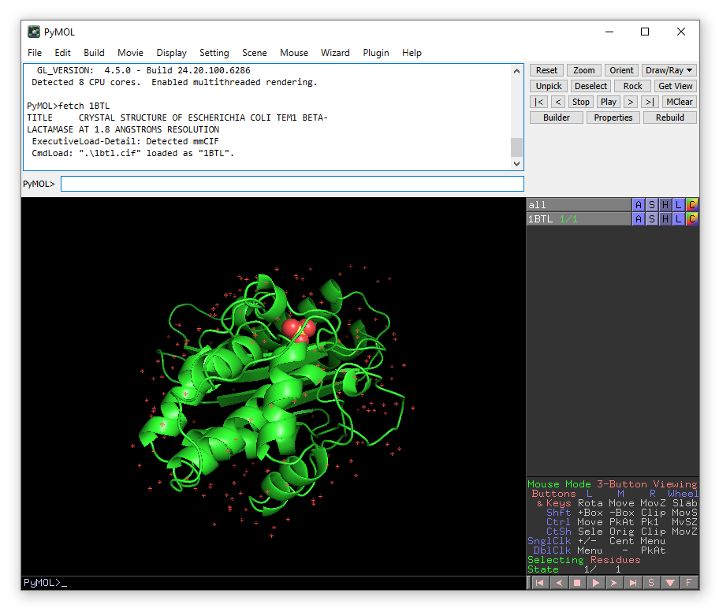

`fetch 4FH2`

A second structure will appear, partly overlapping the first. Press "Reset" 
button in the top left corner to fit both structures in the viewing window. We 
now need to align the structures so that we can use the coordinates of sulbactam 
from 4FH2.

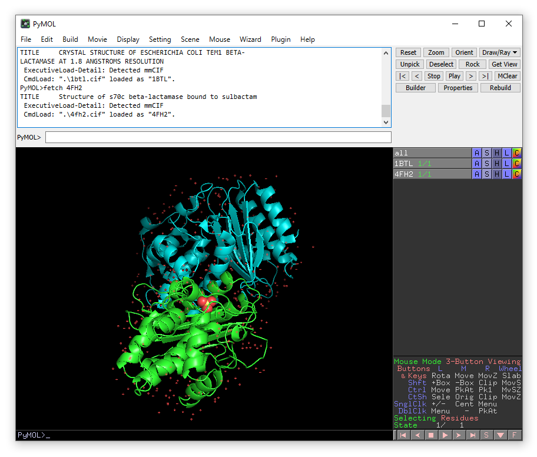


`align 4FH2 and name CA, 1BTL and name CA`

You will see that structure 4FH2 move so that it is aligned with 1BTL based on 
the positions of the alpha carbons.

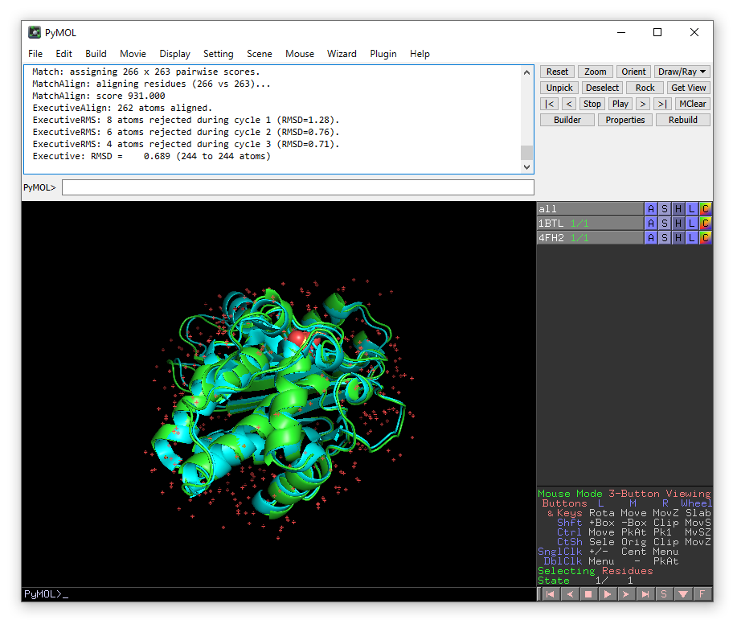

We will now create a new PyMOL object which has the protein coordinates from 
PDB 1BTL and the coordinates of sulbactam from PDB 4FH2. The residue name for 
sulbactam is 0RN.

`select tmp, 1BTL (or 4FH2 and resname 0RN)`

`create 1btl_0rn, tmp`

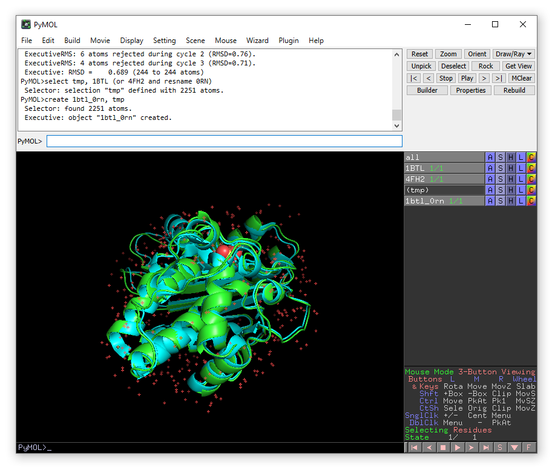

We now have a new object in the right-hand panel of the viewing window called 
1btl_0rn. Hide the original structures 1BTL and 4FH2 by clicking on their names 
in the right-hand panel.

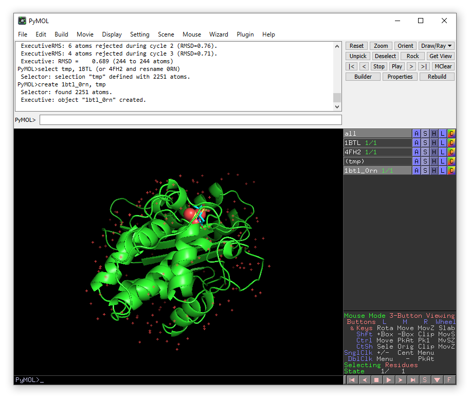

-------

We need to tidy up the structure a little bit before we can begin simulations. 
Firstly, we need to remove an sulfate (SO4) ion that is present from the 
crystalisation conditions. Information about the crystalisation conditions and 
other small molecules that have been identified in the structure is given in the
header of the PDB and also on the 
[structure page](http://www.rcsb.org/pdb/explore/explore.do?structureId=1BTL) 
of the Protein databank.

To remove all sulfate ions (in this case just one):

`remove (1btl_0rn and resname SO4)`

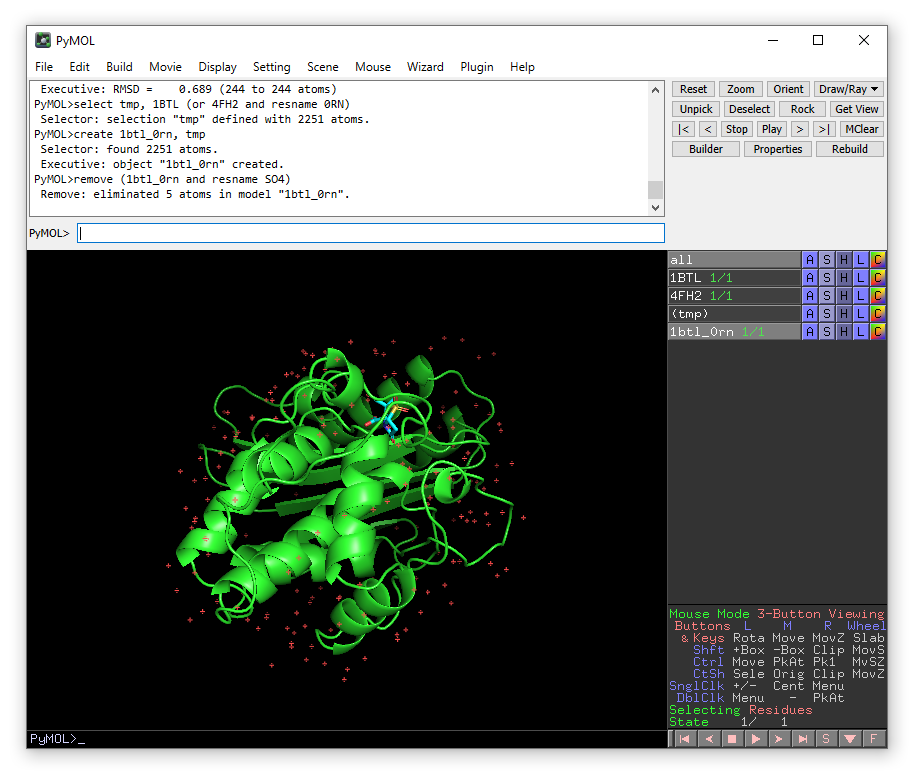

-------

We also need to remove the water molecules that were part of 1BTL in the region 
we have just placed sulbactam. To do this we need to identlfy the water 
molecules overlapping with 0RN in our new model 1btl_0rn.  Now we will zoom in 
on the ligand.

`select 0RN, (1btl_0rn and resname 0RN)`

The new object 0RN will appear in the right-hand panel. From the menu that 
appears when you click the A button for this object choose zoom. 

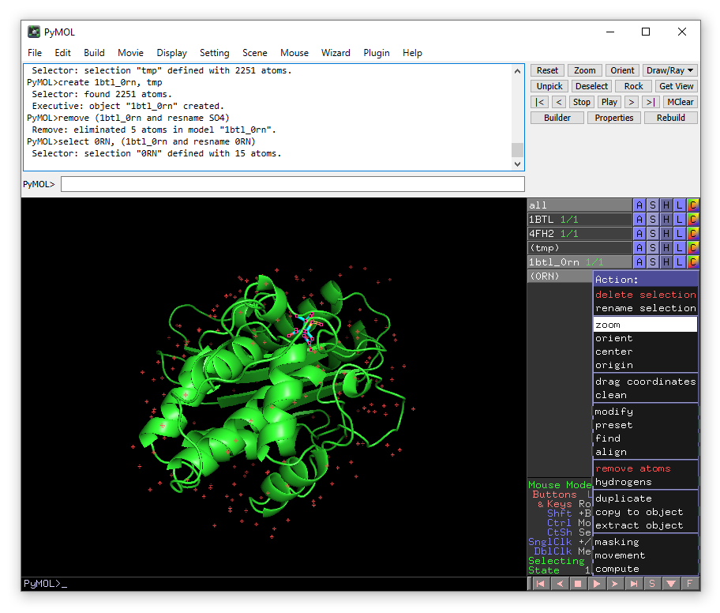


We will now identify the water molecules.

`select HOH, (1btl_0rn and resname HOH within 2.0 of resname 0RN)`

This command will select 4 water molecules, you may wish to zoom on the HOH 
object to see them better. You can also change how the water molecules are 
displayed e.g. choose spheres from the drop-down menu that appears when you 
click on the S button for the HOH object. 

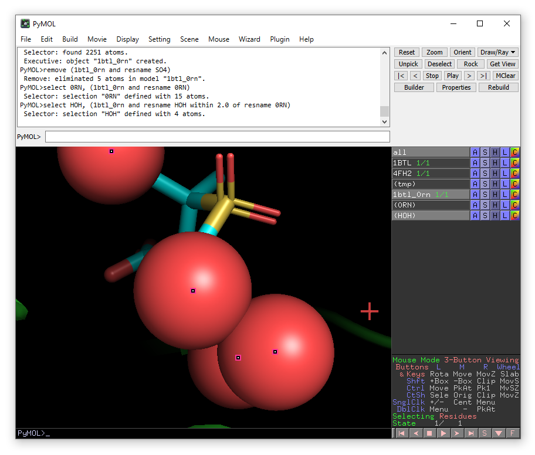

 
If you want to delete all water molecules in the selection HOH (which is 
sensible), you can do:

`remove (1btl_0rn and HOH)`

or go to the A button for the HOH object and choose remove atoms.

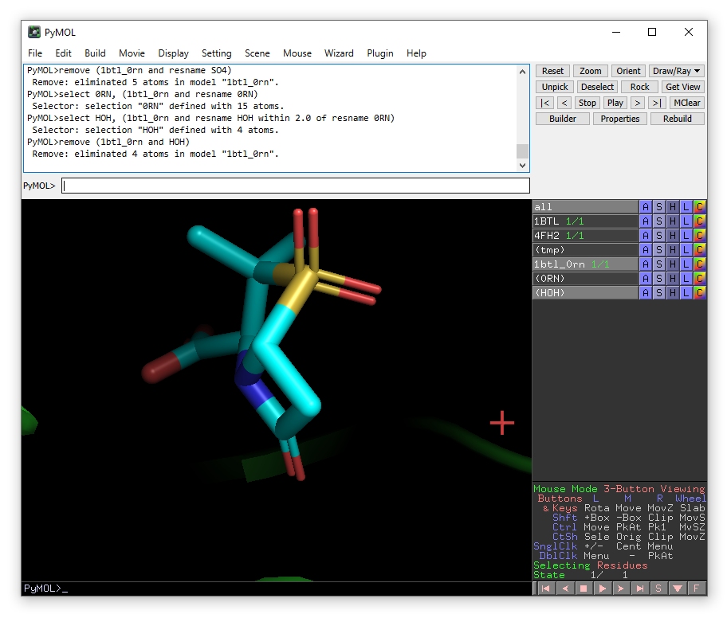

For removing specific water molecules, you can click on the water molecules to 
find their residue numbers. This information will appear in the control window: 

```
Selector: selection "sele" defined with 1 atoms.  
You clicked /1btl_0rn/C/A/HOH`404/O
```

When you have found the residue numbers of the water molecules you want to 
delete, this is how they can be deleted from the structure:

`remove (1btl_0rn and resname HOH and res 323+391+404+437)`
 
-------

We will now add hydrogen atoms to sulbactam using the h_add function in PyMOL. 

`h_add (1btl_0rn and resname 0RN)`
And zoom on the (ORN) selection in the right hand side.

Note that sulbactam has a charge of -1*e* and you will need to check visually to 
make sure that they have been placed reasonably.
 
For ease of identification during simulations we will change the chain id for 
the ligand 0RN. To do so we first update the (0RN) selection to include the 
hydrogen atoms:

`select 0RN, (1btl_0rn and resname 0RN)`
 
And then set the chain id to L:

`alter 0RN, chain="L"`

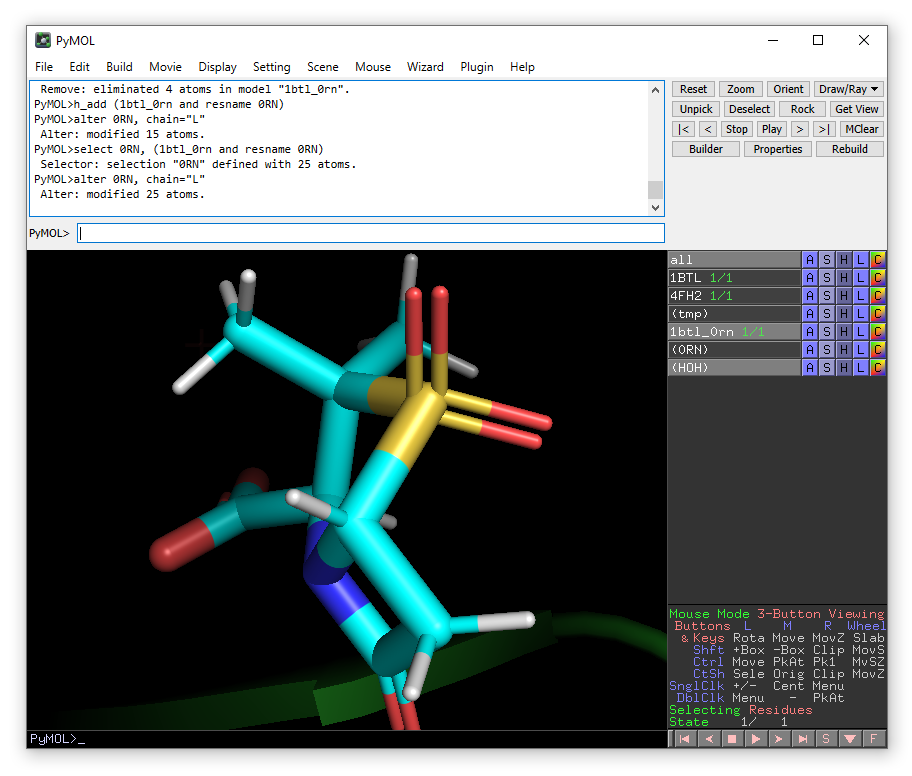


We have now done everything needed to create a model of the wild-type TEM-1 with
sulbactam that can be used as input for *Enlighten*.


## Part 2: Running the *Enlighten* protocols through the plugin 
From the plugin menu choose Enlighten:

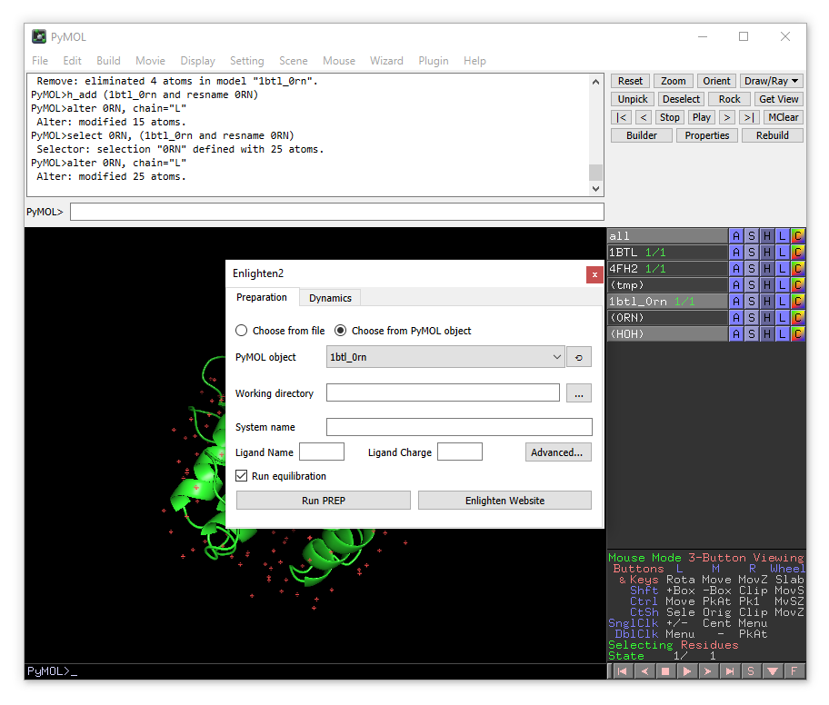

A new enlighten control panel will appear. The currently active object 
(1btl_0rn) will be already chosen by default. You need to choose the working 
directory (where all the files will be stored). We will set the name of the 
system to "1btl_0rn.sp20", because we will generate a solvent sphere of 
20 &#x212B;. You will need to change "Ligand name" to 0RN and "Ligand Charge" 
to -1.

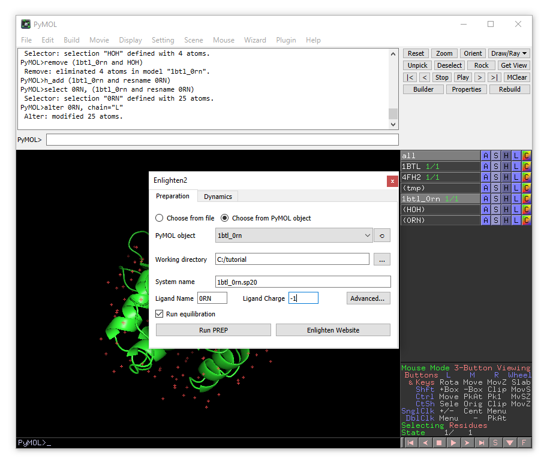

You can also take a look at the advanced options by clicking the "Advanced..."
button.

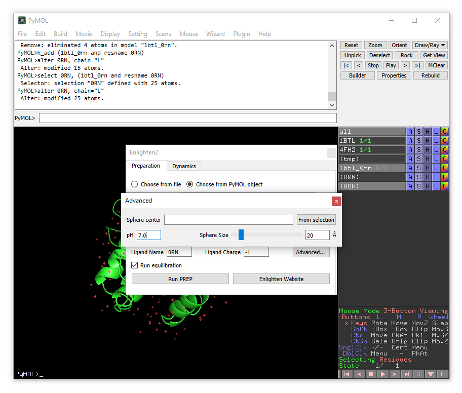

Here you can change the size and position of the solvent sphere as well as the 
pH of the system. The pH parameter only affects the protonation states of the 
titratable residues. The empty "Sphere center" field means that the solvent 
sphere center will be located at the geometric center of the ligand. 
Alternatively, xyz coordinates may be provided manually or taken from a selected 
atom. We will leave all the options as default. 

You can now click RUN PREP.

RUN PREP may take a couple of minutes to complete. it will take longer if you 
run Enlighten for the first time, because Docker has to fetch the Enlighten 
image first. Please wait until the terminal window disappears.

> **NB**: When using Docker Toolbox an error message starting with "mesg: 
ttyname failed..." might appear in the terminal. This message can be safely
ignored.

When PREP has finished successfully, a new object "1btl_0rn.sp20_relax" will 
be loaded into PyMOL. You will see that hydrogens have been added to the 
system and a solvent cap of radius 20 Å has been added to the model.

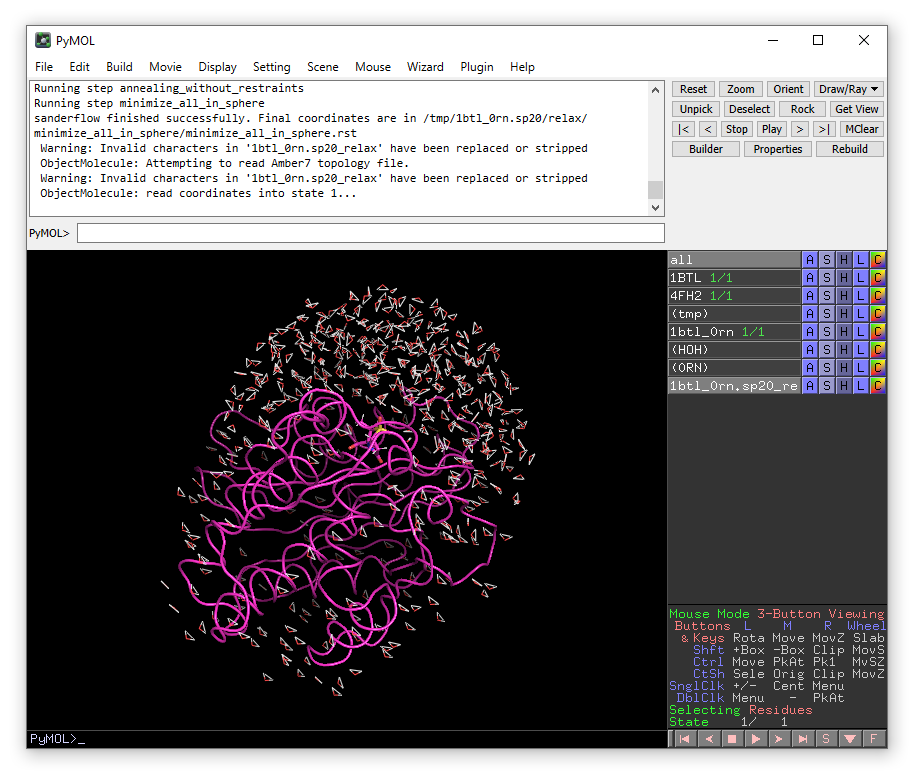

Now click on "Dynamics" tab on the top of the plugin window.

You will see the list of simulations systems that are found in the current
working directory. For now we have only one system (1bt_0rn.sp20) colored in
yellow, meaning that the system is prepared and relaxed, but no production 
dynamics have been performed yet.  

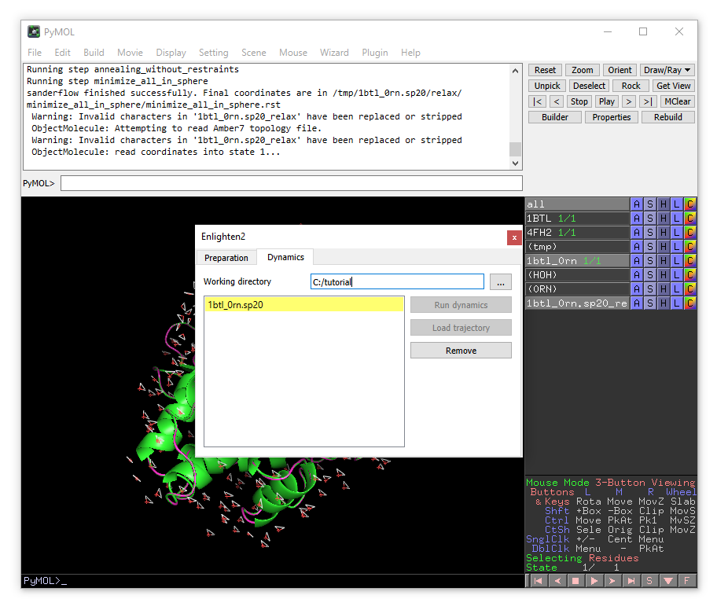

Click on the system name, then click "Run dynamics".

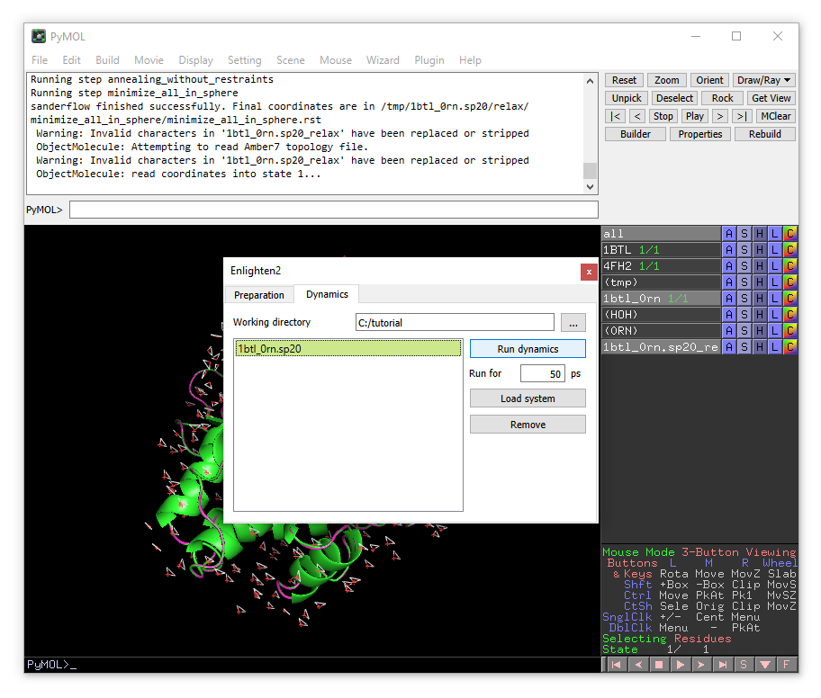

The simulation will take several minutes, the progress will be printed in the 
terminal window.

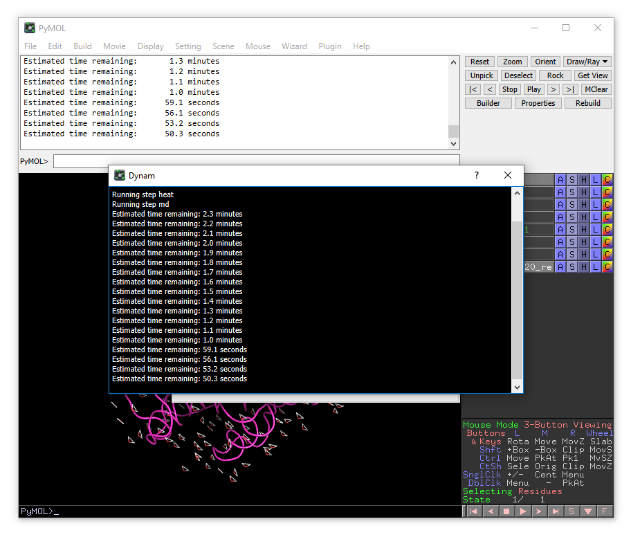


This will take some time to run. One finished, the trajectory will be loaded
automatically into PyMOL.

## Part 3: Creating a mutant and running *Enlighten*

We will now create a mutant structure to simulate for comparison. We will 
make the R244T mutation, which causes a 300-fold increase in *Ki* for sulbactam 
(*i.e.* a decrease in binding affinity). See 
<http:www.jbc.org/content/267/29/20600.full.pdf> for the experimental details.

We will start by copying our object 1btl_0rn to the new object 1btl_0rn_r244t.

`create 1btl_0rn_r244t, 1btl_0rn`

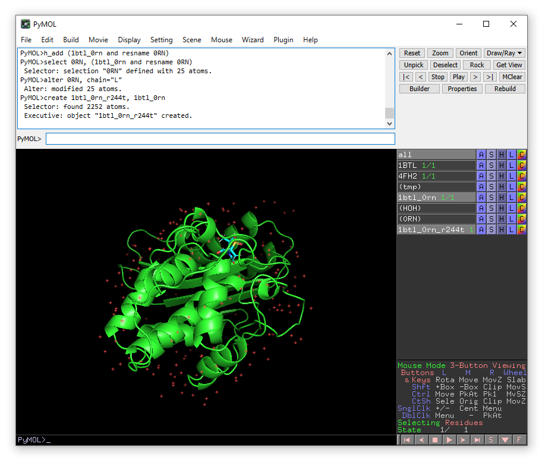

We want to mutate Arg244 to Thr, so we will zoom in on this residue and show it
as sticks.

`select r244, (1btl_0rn_r244t and resi 244)`

From the Wizard drop-down menu, select Mutagenesis -> Protein:

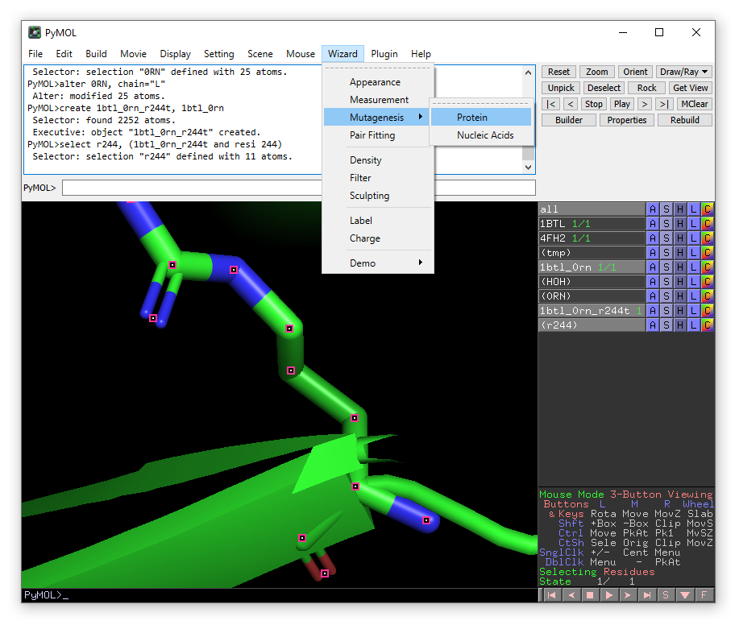

Click on Arg244 and then  In the right hand panel choose Thr from the mutation 
menu (the one currently saying "No Mutation") in the right-hand panel. 

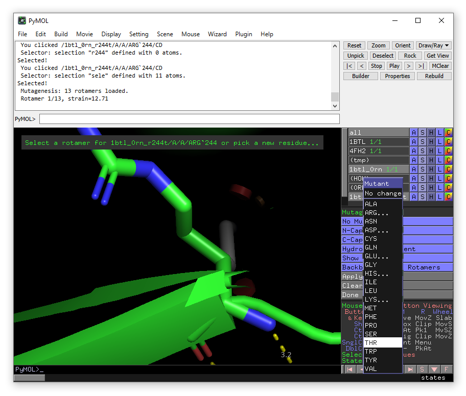

The lowest energy rotamer will then be displayed. Click apply to accept the 
mutation and then done to exit the wizard.

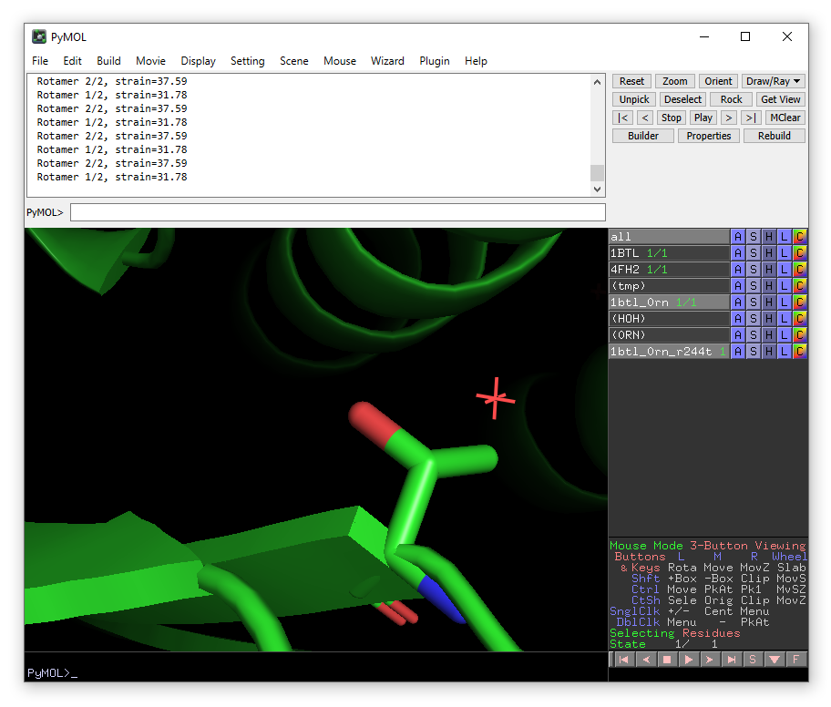

Now open Enlighten. Ensure that the new 1btl_0rn_r244t object is selected in 
PyMOL object field and run preparation and dynamics on the mutant.  

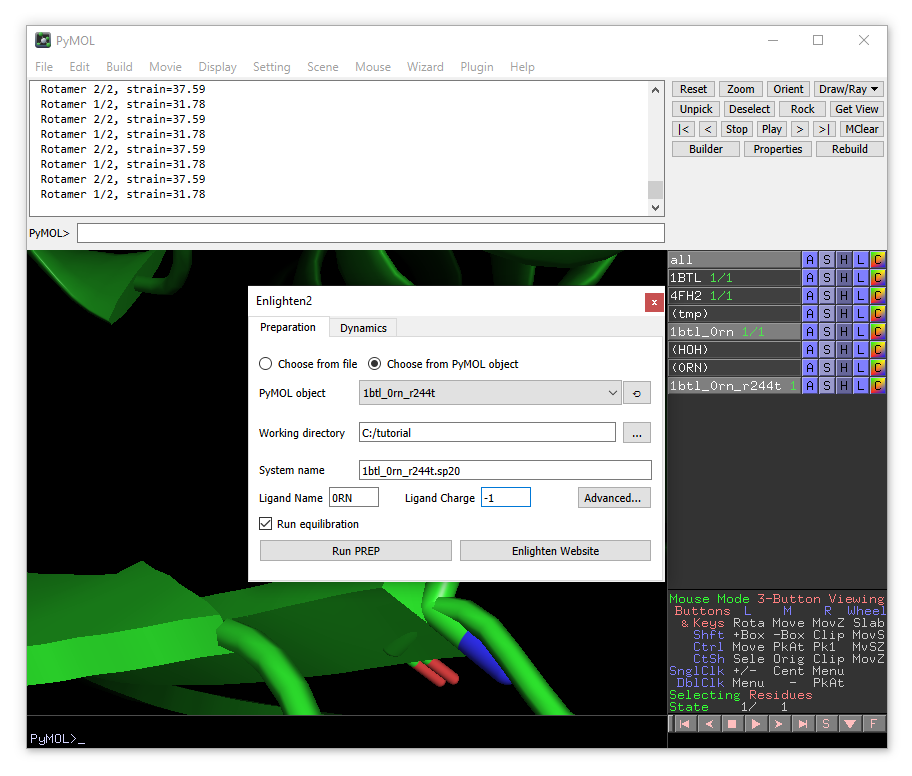

When finished, the simulation of the mutated system will be automatically
loaded into PyMOL. Also you will see that both entries in the systems list
are shown in green, meaning that the molecular dynamics simulations have been 
successfully performed. Even if you exit PyMOL and open again, you can load the 
trajectories through the Enlighten plugin by specifying the working directory,
selecting the system and clicking "Load trajectory". 

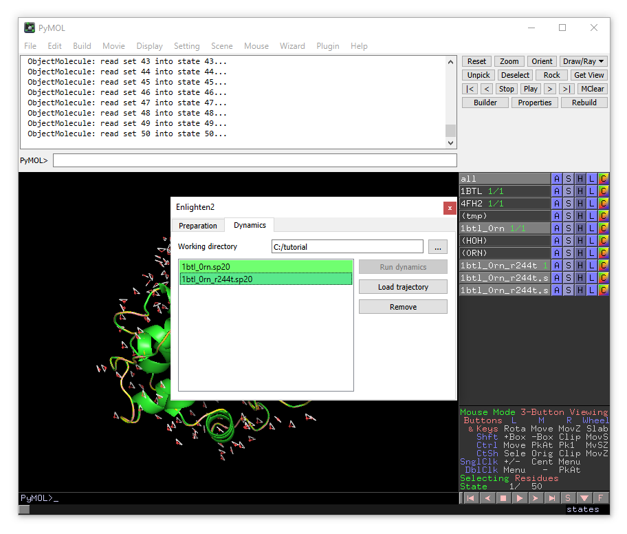