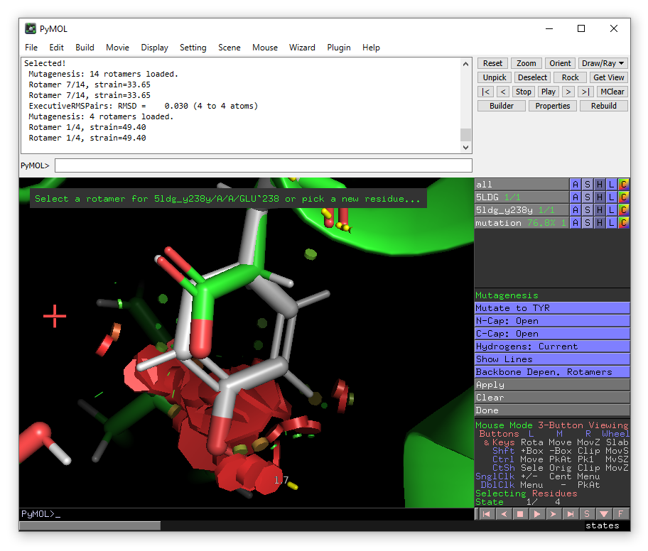

# Enlighten Tutorial 2: enzyme with co-factor
As an example of an enzyme system with a (non-covalently bound) co-factor, we will 
use an NADP(H) containing reductase enzyme: isopiperitenone reductase. The 
starting point is PDB 5LDG, the structure of isopiperitenone reductase complexed 
with its substrate and NADP (see further 
[this paper](http://dx.doi.org/10.1002/ange.201603785)). We will need to supply 
parameters for the NADP co-factor.

> **NB**: Whenever text is written in a `box like this`, it is a command that 
should be typed on a "command line", either in a "terminal" or in the PyMOL 
control panel.

> **NB**: Before running Enlighten2 through PyMOL, ensure that Docker is 
installed and running in the background.

## Part 1: Preparing the model and co-factor parameters
We will use PyMOL to obtain the crystal structure we need directly from the 
protein databank. In the control panel type:

`fetch 5LDG`

A crystal structure will appear in the viewing window. You will also see an 
object called 5LDG appear in the right-hand viewing panel. There are buttons 
A,S,H etc. which contain drop down menus that allow you to make changes to how 
the object is viewed. You can zoom in on the isopiperitenone substrate and 
NADP(H) (which have residue names IT9 and NAP respectively):

`zoom resname IT9+NAP`

You will notice that in this PDB, hydrogen atoms are already present. This means 
that in principle, we can start using *Enlighten* directly on this object. 
**But** we will need to define parameters for the NADP co-factor. To do this, we
will need two additional files: 

- A 'topology' file that 'translates' atom names (from the PDB) into 
*atom types*, sets which 'partial charges' these atoms will have, and defines 
how they are bonded to each other. This file defines the molecule (co-factor), 
so that parameters can be assigned. For Amber/AmberTools, these files typically 
have the extensions **.prep**, **.prepc**, or **.off**
- A 'parameter' file with any parameters between the atom types in the co-factor 
that are not 'known' in the standard force field. For Amber/AmberTools, these 
files typically have the extension **.frcmod**

For several co-factors, parameters from the literature are gathered in the 
[AMBER parameter database](http://research.bmh.manchester.ac.uk/bryce/amber). 
Here, we will use the parameters contributed by Ulf Ryde 
(see [here](http://personalpages.manchester.ac.uk/staff/Richard.Bryce/amber/cof/nad_ryde_inf.html) 
for information, including references to papers to cite).

We can download the 
[nadp+.prep](http://personalpages.manchester.ac.uk/staff/Richard.Bryce/amber/cof/nadp+.prep) 
and [nad.frcmod](http://personalpages.manchester.ac.uk/staff/Richard.Bryce/amber/cof/nad.frcmod) files. 
Now, we need to make sure that:

1. The atom names in the .prep file directly correspond to the atom names for 
NAD in the PDB file 5LDG (and similarly for the residue name). As usual, this 
is not the case, and you will need to edit the .prep file *or* the .pdb file.
2. *Enlighten* will understand to use the .prep and .frcmod files for the 
residue NAP. Currently, this will be the case if the files are in the same 
directory where you run *Enlighten*, *and* filenames are the same as the 
three-letter residue name in the PDB, and the extensions are **.prepc** or 
**.off** for the 'topology' file and **.frcmod** for the parameter file 
(see above). 

Point **1** requires careful (manual) editing of the nadp+.prep file. Point 
**2** just requires you to rename the files to NAP.prepc and NAP.frcmod 
(because the NADP co-factor has the residue name NAP in 5LDG), and place them 
in the working directory where you will run *Enlighten*.

To help you out, the correctly edited NAP.prepc file can be found 
[here](/assets/tutorial2/NAP.prepc), and the NAP.frcmod file (which is the same 
as [nad.frcmod](http://personalpages.manchester.ac.uk/staff/Richard.Bryce/amber/cof/nad.frcmod))
can be downloaded from [here](/assets/tutorial2/NAP.frcmod).

Now, you are ready to run *Enlighten* on 5LDG.

## Part 2: Running the *Enlighten* protocols through the plugin 
We are now ready to use Enlighten to perform some simulations. 
Go to the Plugin drop-down menu and choose "Enlighten". A (new) *Enlighten* control panel will 
appear. Choose the PyMOL object 5DLG (if it is not already selected).
The entry for *System name* is arbitrary - it can be what you choose. Results will 
be stored in a sub-directory with this name. Here we will use "5ldg_it9.sp20", because we 
will generate a solvent sphere of 20 &#x212B;. You will need to enter IT9 as the *Ligand 
Name*. Check that the other output settings are suitable (note that 
*Ligand Charge* should be 0) and ensure that the NAP.frcmod and NAP.prepc files are 
in the chosen Working directory. You should then then click Run PREP (with "Run equilibration")
ticked.

Run PREP may take a couple of minutes to complete. Wait until the terminal 
window disappears. This means the protocol has finished successfully. If not, 
please note the message printed for more information.

When PREP has finished successfully, a new object ending with "_relax" will have 
been loaded into PyMOL. You will see that hydrogens have been added to the 
crystallographic water molecules and additional water molecules in a "solvent 
cap" of radius 20 Å have been added to the model.

Now click on "Dynamics" tab on the top of the plugin window, click on the system 
name, then click "Run dynamics".

This will take some time to run (estimated times will be printed in the PyMOL 
control panel), so we can now start to prepare a mutant model.

## Part 3: Creating a mutant and running *Enlighten*

We will now create a mutant structure to simulate for comparison. We will make 
the E238Y mutation, which was shown to switch the activity of the enzyme towards 
ketoreduction. See [the paper](http://dx.doi.org/10.1002/ange.201603785) for 
details.

**NB**: If the simulation of the wild type enzyme is still running, you can open
a second instance of pymol add execute `fetch 5LDG` to continue.  

We will start by copying our object 5LDG to the new object 5ldg\_e238y.

`create 5ldg_e238y, 5LDG`

We want to mutate Glu238 to Tyr, so we will show this residue in sticks 
and zoom in on it.

`show st, 5ldg_e238y and res 238`

`zoom 5ldg_e238y and res 238`

From the Wizard drop-down menu, select Mutagenesis -> Protein:

Click on Glu238 and then choose Tyr from the *mutate to* menu in the right-hand panel. 

The lowest energy rotamer will then be displayed. 

Even though in this case, there is a significant clash with the substrate IT9, go ahead and click *apply* to accept the mutation and then *done* to exit the wizard.

From the plugin menu choose *Enlighten* again.

A *new* enlighten control panel will appear. To run simulations on the mutant 
model, ensure that the new 5ldg\_e238y object is selected in the list and fill 
in the other fields similar to before (e.g. using 5ldg\_e238y.sp20 as the system name).
When done, click Run PREP. 

Once PREP is done, you will see that the object 5ldg\_e238y.sp20_relax has been loaded. 
Note that there will be 'bonds' shown between the clashing Tyr238 and the substrate. You can 
remove the 'bonds' visualisation of the non-physical bonds using:

`unbond resname IT9, res 234`

Now you can run dynamics on the mutant model through Dynamics tab. 

## Part 4: Analysis

The MD trajectory should be automatically loaded into the objects when DYNAM is 
finished. Press the play button to move between the frames. You can adjust the 
number of frames per second in the Movie drop-down menu. You can use the 
measurement function in the Wizard menu to monitor distances during the MD 
simulation. 

Zoom in on isopiperitenone (`zoom resname IT9`) and compare the position between 
wild-type (5LDG) and the E238Y mutant (5ldg_e238y). Also compare the position of 
the (mutated) residue, Glu238 or Tyr238 (both now renumbered as 234). You could 
now compare this to the proposed mechanisms in 
[Scheme 2](http://onlinelibrary.wiley.com/enhanced/figures/doi/10.1002/ange.201603785#figure-viewer-ange201603785-fig-5002) 
of [the paper](http://dx.doi.org/10.1002/ange.201603785), and see if the 
simulations can help you to explain the difference between wild-type IPR and 
IPR E238Y. 

(Note that we simulated NADP+, not NADPH, and simulations were performed with 
the isopiperitenone substrate only. You could further extend this study by using 
NADPH and re-running simulations with menthone instead of isopiperitenone.) 

-----------

Bugs in the Enlighten plugin or scripts can be reported as an "Issue" through 
the [github site](https://github.com/vanderkamp/enlighten2/issues).

If you have in-depth feedback or thoughts about Enlighten you would like to share, please [get in touch](mailto:marcvanderkamp@gmail.com).

### Thank you!
